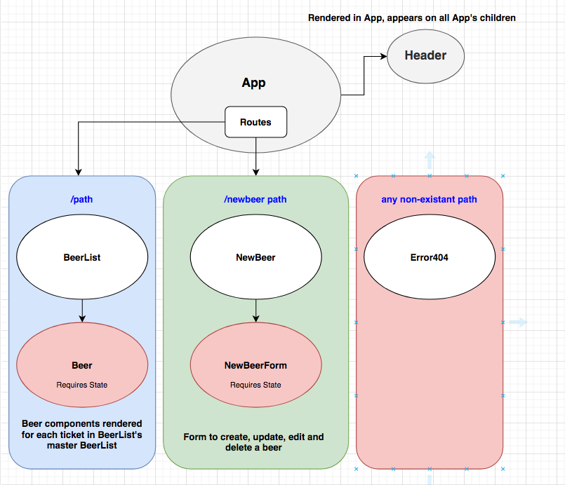

# _Tap Room_

#### _An application built with create-react-app which displays a beer menu for a tap room, 2/21/2020_

#### By _**Kyle Wymer**_

## Description

_This application allows a user to view a live updating menu for a tap room. Users are also able to add a new beer to the beer list using the new beer form._

## Specifications

* _Users are able to view a rotating menu of beers_

## App Component structure

## Setup/Installation Requirements
* _Clone or download the repository from GitHub_
* _Navigate to the root directory of the cloned repository via terminal_
* _In the terminal, run $ npm install_
* _Then run $ npm start_
* _To seed the database with animals, run $ rake db:seed_
* _The server should now connect to localhost and open in your browser automatically_

## Known Bugs

_No known bugs_

## Support and contact details

_Please contact Kyle Wymer, at wymerkd@gmail.com if support is needed_

## Technologies Used

* _React_
* _JavaScript_
* _Bootstrap_
* _creat-react-app_
* _node.js_

### License

*Copyright <2020> <Kyle Wymer, Epicodus>

Permission is hereby granted, free of charge, to any person obtaining a copy of this software and associated documentation files (the "Software"), to deal in the Software without restriction, including without limitation the rights to use, copy, modify, merge, publish, distribute, sublicense, and/or sell copies of the Software, and to permit persons to whom the Software is furnished to do so, subject to the following conditions:

The above copyright notice and this permission notice shall be included in all copies or substantial portions of the Software.

THE SOFTWARE IS PROVIDED "AS IS", WITHOUT WARRANTY OF ANY KIND, EXPRESS OR IMPLIED, INCLUDING BUT NOT LIMITED TO THE WARRANTIES OF MERCHANTABILITY, FITNESS FOR A PARTICULAR PURPOSE AND NONINFRINGEMENT. IN NO EVENT SHALL THE AUTHORS OR COPYRIGHT HOLDERS BE LIABLE FOR ANY CLAIM, DAMAGES OR OTHER LIABILITY, WHETHER IN AN ACTION OF CONTRACT, TORT OR OTHERWISE, ARISING FROM, OUT OF OR IN CONNECTION WITH THE SOFTWARE OR THE USE OR OTHER DEALINGS IN THE SOFTWARE.*
